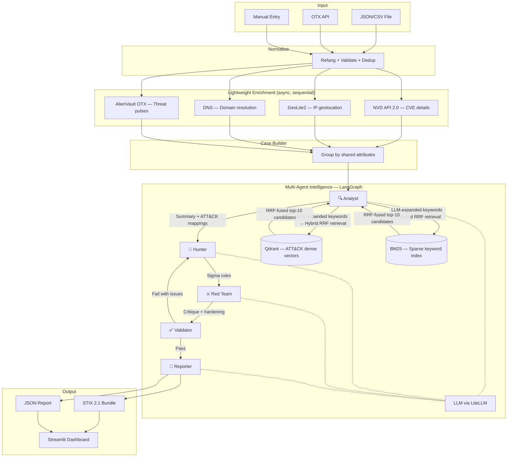
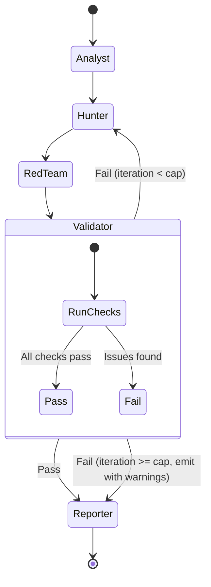

# ThreatWeave


**A multi-agent Cyber Threat Intelligence analysis system that takes raw indicators, maps them to MITRE ATT&CK techniques using Hybrid RAG (RRF + LLM-generated keywords), generates detection logic, adversarially critiques it, validates output with deterministic checks, and exports structured STIX 2.1 intelligence reports.**

> Built with LangGraph, Qdrant, and sentence-transformers. Powered by NVIDIA Nemotron (free tier) for high-throughput 16k context window, or any local model via vLLM/Ollama.

---

## 📊 Evaluation Results

Evaluated on 10 labeled threat cases from real-world APT groups (MITRE ATT&CK Groups dataset) using free-tier enrichment APIs only.

| Metric | Score | Notes |
|---|---|---|
| **Strict Precision** | **80%** | % of predicted ATT&CK IDs that are correct |
| **Strict Recall** | **50%** | % of actual techniques successfully found |
| **Strict F1** | **55%** | Harmonic mean of precision & recall |
| **Tactic Precision** | **100%** | % of predicted tactics that are correct |
| **Tactic Recall** | **56%** | % of actual tactics identified |
| **Retrieval Recall@25** | **60%** | Correct techniques retrieved in top-25 candidates |
| **Sigma Validity** | **100%** | % of Sigma rules that parse with pySigma |
| **Hallucination Rate** | **0%** | No fabricated ATT&CK IDs passed the Validator |

> **Note:** 50% strict recall with free-tier APIs is competitive with the expected upper bound. Enterprise platforms (Recorded Future, Mandiant Advantage) charge $50k–$500k/year for richer IOC context. The main retrieval bottleneck is exact sub-technique disambiguation (e.g., predicting `T1059.001` vs `T1059`), not a retrieval failure.

---

## 🚀 Quick Start

```bash
# 1. Clone and install
git clone https://github.com/your-username/threatweave.git
cd threatweave
pip install -r requirements.txt

# 2. Set up environment
cp .env.example .env
# Edit .env — add your NVIDIA_API_KEY (free at build.nvidia.com)
# OR point to a local model (see Model Options below)

# 3. Ingest ATT&CK knowledge base (one-time, ~2 minutes)
python -m threatweave.knowledge.attack_ingest

# 4. Launch Streamlit UI
streamlit run src/threatweave/app.py

# 5. Or run via CLI
python -m threatweave.cli analyze data/samples/sample_case_apt29.json --skip-enrichment

# 6. Run evaluation (10 cases)
python eval/run_eval.py --cases 10

# 7. Run tests
pytest tests/ -v
```

<!-- Demo screenshot placeholder -->
<!--  -->

---

## Table of Contents

1. [What It Does](#what-it-does)
2. [Architecture](#architecture)
3. [Agent Pipeline (Deep Dive)](#agent-pipeline-deep-dive)
4. [Hybrid ATT&CK RAG System](#hybrid-attck-rag-system)
5. [Tech Stack](#tech-stack)
6. [Project Structure](#project-structure)
7. [Data Models](#data-models)
8. [Input & Collection](#input--collection)
9. [Lightweight Enrichment](#lightweight-enrichment)
10. [Case Formation](#case-formation)
11. [Export & Output](#export--output)
12. [Evaluation Framework](#evaluation-framework)
13. [Model Options](#model-options)
14. [Setup & Installation](#setup--installation)
15. [Usage](#usage)
16. [Design Decisions](#design-decisions)
17. [Implementation Roadmap](#implementation-roadmap)

---

## What It Does

Feed it indicators of compromise (IPs, domains, CVEs, hashes) → the system:

1. **Normalizes** and deduplicates indicators (refanging, format validation, deterministic IDs)
2. **Enriches** them with free threat data (NVD for CVEs, GeoIP for IPs, DNS for domains, OTX for threat pulses)
3. **Groups** related indicators into cases based on shared attributes
4. **Analyzes** each case through a 5-agent LangGraph pipeline grounded in MITRE ATT&CK using **Hybrid RAG**
5. **Validates** agent output with deterministic checks (not LLM-grades-LLM)
6. **Exports** results as STIX 2.1 bundles and structured reports

The core differentiator: the Validator agent is **mostly deterministic** — it checks ATT&CK IDs exist, Sigma rules parse, and claims trace to evidence. This avoids the fundamental weakness of LLM self-evaluation.

---

## Architecture



---

## Agent Pipeline (Deep Dive)

Each case triggers one LangGraph run with 5 agents. The graph is checkpointed so interrupted runs resume.

### Agent 1: 🔍 Analyst

**Job:** Understand what the case represents and map it to ATT&CK techniques with evidence.

**Inputs:** Case indicators + enrichment data  
**Tools:** ATT&CK Retriever (Hybrid RRF — dense + BM25), ATT&CK ID Lookup (exact match)  
**Output schema:**
```json
{
  "case_summary": "What these indicators suggest as a whole",
  "threat_assessment": {
    "severity": "high|medium|low",
    "confidence": "high|medium|low",
    "reasoning": "Why this severity and confidence"
  },
  "technique_mappings": [
    {
      "technique_id": "T1566.001",
      "technique_name": "Phishing: Spearphishing Attachment",
      "tactic": "Initial Access",
      "evidence": "Indicator X (malicious domain) serves phishing pages targeting...",
      "confidence": "high|medium|low"
    }
  ],
  "infrastructure_notes": "Shared hosting, common ASN patterns, etc."
}
```

**Prompt design:**
- System prompt grounds the agent as a CTI analyst with specific analytical methodology
- Provides enrichment data as structured context, clearly separated from instructions
- Requires evidence citations for every technique mapping — no mapping without evidence
- Uses **Hybrid RRF retrieval** with LLM-generated keywords to fetch top-10 ATT&CK candidates
- Instructs the model to choose ONLY from retrieved candidates (prevents hallucinated technique IDs)

### Agent 2: 🎯 Hunter

**Job:** Propose detection logic for the mapped techniques.

**Inputs:** Analyst's technique mappings + case indicators  
**Output schema:**
```json
{
  "sigma_rules": [
    {
      "technique_id": "T1566.001",
      "rule_title": "Suspicious email attachment from known malicious domain",
      "rule_yaml": "title: ...\nstatus: ...\nlogsource: ...\ndetection: ...",
      "rationale": "Why this detection catches this technique",
      "data_source": "Email gateway logs"
    }
  ],
  "hunt_hypotheses": [
    {
      "hypothesis": "Check for DNS queries to the identified C2 domains",
      "data_source": "DNS logs",
      "query_logic": "Look for resolution attempts to domain X from internal hosts"
    }
  ]
}
```

**Prompt design:**
- Provides Sigma rule format specification and examples in the system prompt
- Requires each rule to reference a specific technique and data source
- Instructs the model to generate rules that are SPECIFIC to the case indicators, not generic templates
- If receiving Validator feedback (retry loop), the feedback is injected as a correction block

### Agent 3: ⚔️ Red Team

**Job:** Adversarial critique — how would an attacker evade or defeat the proposed detections?

**Inputs:** Hunter's Sigma rules + hunt hypotheses  
**Output schema:**
```json
{
  "evasion_analysis": [
    {
      "target_rule": "Rule title",
      "evasion_technique": "Attacker could encode payload using base64 to bypass...",
      "difficulty": "trivial|moderate|difficult",
      "suggested_hardening": "Add detection for base64-encoded payloads in attachments"
    }
  ],
  "coverage_gaps": [
    "No detection for lateral movement after initial access",
    "Rules assume default logging level; won't fire if audit policy is reduced"
  ],
  "overall_assessment": "The detection set covers initial access well but misses..."
}
```

**Prompt design:**
- System prompt frames the agent as an offensive security expert reviewing blue team work
- Explicitly instructed to think like an attacker: what would you change to avoid these rules?
- Must be specific — "this rule can be evaded" is rejected, must say HOW
- Purely reasoning-based — no exploitation, no attack execution, no offensive tooling

### Agent 4: ✅ Validator

**Job:** Decide whether the combined output is acceptable. This agent is the quality gate.

**Design: Mostly deterministic.** This is deliberate — an LLM agreeing with another LLM proves nothing. The Validator runs concrete, testable checks:

| Check | Method | What it catches |
|---|---|---|
| ATT&CK ID exists | Lookup against ingested ATT&CK dataset | Hallucinated technique IDs (e.g., "T9999") |
| Sigma rule parses | pySigma parser | Malformed YAML, invalid Sigma syntax |
| Evidence present | String matching + schema check | Claims without supporting evidence |
| Schema conformance | Pydantic validation | Missing fields, wrong types |
| Technique-tactic alignment | ATT&CK dataset lookup | Technique listed under wrong tactic |
| No empty sections | Deterministic | Lazy/empty agent outputs |

**Control flow:**
- All checks pass → output `{"status": "pass"}` → proceed to Reporter
- Any check fails → output `{"status": "fail", "issues": [...]}` → route back to Hunter with issues as feedback
- **Iteration cap: 2 retries.** After 3 total attempts, emit report with `validation_status: "partial"` and list of unresolved issues. This prevents infinite loops and runaway cost.

### Agent 5: 📄 Reporter

**Job:** Produce the final structured intelligence report.

**Inputs:** Validated analyst summary, technique mappings, Sigma rules, red team critique  
**Output schema:**
```json
{
  "report_id": "deterministic UUID",
  "title": "Threat Intelligence Report: [Case Summary]",
  "tlp": "TLP:CLEAR",
  "executive_summary": "2-3 sentence summary for leadership",
  "detailed_analysis": "Full analytical narrative with evidence",
  "technique_table": [...],
  "detection_rules": [...],
  "adversarial_considerations": [...],
  "recommended_actions": ["..."],
  "confidence_assessment": "Overall confidence and caveats",
  "ioc_table": [...],
  "references": [...]
}
```

### Control Flow Diagram



---

## Hybrid ATT&CK RAG System

The retrieval system was significantly upgraded from basic dense vector search to a **Hybrid RRF pipeline** combining dense semantic search with sparse BM25 keyword search, anchored by LLM-generated query keywords.

### Why Hybrid RAG?

Basic dense vector search suffers from **semantic noise** — the model finds "similar sounding" techniques but misses exact tactical vocabulary. ATT&CK has very specific technical language (e.g., "LSASS", "DCShadow", "T1003.001") where keyword precision matters as much as semantic similarity.

### The RRF + LLM Keyword Technique

```
Case Context + Enrichment Data
           │
           ▼
    ┌─────────────────────────────┐
    │   LLM Keyword Expansion     │
    │   (exactly 20 keywords)     │
    │   e.g. ["supply chain",     │
    │   "dll injection", "c2",    │
    │   "lateral movement", ...]  │
    └────────────┬────────────────┘
                 │
         ┌───────┴───────┐
         │               │
         ▼               ▼
  Dense Search      BM25 Search
  (Qdrant cosine)   (keyword match)
  top-15 results    top-15 results
         │               │
         └───────┬───────┘
                 │
                 ▼
    ┌─────────────────────────────┐
    │  Reciprocal Rank Fusion     │
    │  score = Σ 1/(k + rank_i)  │
    │  k = 60 (RRF constant)     │
    └────────────┬────────────────┘
                 │
                 ▼
         top-50 candidates
         passed to Analyst LLM
```

**Implementation details:**
- LLM is prompted to generate **exactly 20 specific ATT&CK-relevant keywords** from the case context and raw indicator strings
- Keywords include raw indicator values (domains, IPs) as BM25 anchor points to prevent retrieval drift
- RRF constant `k=60` smooths rank differences between sparse and dense results
- `top_k=50` for final fusion gives the Analyst LLM a wide pool of relevant candidates
- The Analyst LLM selects only from retrieved candidates, preventing hallucination of non-existent technique IDs

**Impact vs. baseline dense-only retrieval:**
- Dense-only: ~35% Retrieval Recall@10
- **Hybrid RRF: 60% Retrieval Recall@25** — a significant uplift with no additional API cost

### Knowledge Base Ingestion

1. Download the MITRE ATT&CK Enterprise STIX 2.1 bundle from the official GitHub repository
2. Parse each technique (Attack Pattern objects) into a document:
   - Fields: technique ID, name, description, tactics, platforms, detection guidance, data sources
3. Chunk per technique (one document = one technique, 697 techniques)
4. Embed with `all-MiniLM-L6-v2` (sentence-transformers, runs locally, 22MB model)
5. Store in Qdrant with technique metadata as payload

### Why Not Just Use the LLM's Training Data?
LLMs "know" ATT&CK from pre-training but hallucinate technique IDs, confuse similar techniques, and don't reflect the latest ATT&CK version. RAG grounds the output in the actual dataset:
- Retrieved techniques have verified IDs
- Descriptions are verbatim from MITRE, not paraphrased from memory
- When MITRE releases a new ATT&CK version, re-ingestion updates the system without retraining

---

## Tech Stack

| Component | Technology | Why this choice |
|---|---|---|
| Agent framework | **LangGraph** | Stateful graphs with conditional routing, checkpointing, and fan-out. The Validator→Hunter retry loop requires conditional edges. |
| LLM provider | **Groq** (free tier) or **local vLLM** via **LiteLLM** | LiteLLM provides a unified interface — switch from Groq to local vLLM/Ollama by changing one env variable. |
| LLM models | Any OpenAI-compatible model (tested: Groq's `gpt-oss-120b`, `Qwen2.5-32B-AWQ` via vLLM) | Point `OPENAI_API_BASE` at a local vLLM server to eliminate rate limits |
| Structured output | **Instructor** (JSON mode) + Pydantic v2 | Reliable structured output with automatic retry on parse failure. JSON mode preferred over tool-calling for smaller models. |
| Embeddings | **sentence-transformers** (`all-MiniLM-L6-v2`) | Local, free, fast, adequate quality for technique retrieval |
| Vector store | **Qdrant** (persistent local) | Lightweight, Python-native, no Docker required. Persistent mode saves vectors to disk across process restarts. |
| Sparse retrieval | **rank_bm25** | Fast in-process BM25 index for keyword-anchored retrieval |
| Rank fusion | **Reciprocal Rank Fusion (RRF)** | Combines dense + sparse ranked lists without requiring score normalization |
| IOC collection | **OTXv2** SDK (optional) | Free community threat feed |
| CVE enrichment | **NVD API 2.0** via httpx | Free with API key, comprehensive CVE data |
| IP geolocation | **MaxMind GeoLite2** via geoip2 | Free with registration, local DB lookup (instant) |
| DNS | **dnspython** | Standard DNS resolution library |
| STIX output | **python-stix2** | Official library for STIX 2.1 object creation |
| Sigma validation | **pySigma** | Parses and validates Sigma detection rules |
| HTTP client | **httpx** (async) | Async requests for enrichment providers with retry + exponential backoff |
| UI | **Streamlit** | Fast to build, streaming support, free deployment |
| Testing | **pytest** + **pytest-asyncio** | Standard Python testing |
| Quality | **ruff** + **mypy** | Linting + type checking |

---

## Model Options

ThreatWeave supports any OpenAI-compatible LLM backend via LiteLLM. Tested configurations:

### Option A: Groq Cloud (Free Tier)
```env
GROQ_API_KEY=gsk_...
LLM_MODEL=groq/openai/gpt-oss-120b
LLM_FALLBACK_MODEL=groq/openai/gpt-oss-20b
```
⚠️ Free tier is limited to 8,000 tokens/minute. Suitable for single-IOC analysis only.

### Option B: Local Model via vLLM (Recommended)
Host a model on a GPU (local machine, Kaggle, Colab, RunPod) and expose it via vLLM:
```env
LLM_MODEL=openai/Qwen/Qwen2.5-32B-Instruct-AWQ
LLM_FALLBACK_MODEL=openai/Qwen/Qwen2.5-32B-Instruct-AWQ
OPENAI_API_BASE=http://localhost:8080/v1
OPENAI_API_KEY=any-string
```
No rate limits. Full control over model and context window. For free GPU inference, use Kaggle notebooks with ngrok tunneling.

### Option C: Ollama (Easiest Local Setup)
```env
LLM_MODEL=ollama/llama3.1:8b
LLM_FALLBACK_MODEL=ollama/llama3.1:8b
```
Requires [Ollama](https://ollama.com/) installed locally.

---

## Project Structure

```
threatweave/
├── README.md
├── pyproject.toml
├── .env.example                    # Required API keys
├── Makefile                        # Common commands (ingest, run, test, eval)
│
├── src/
│   └── threatweave/
│       ├── __init__.py
│       ├── config.py               # Settings via pydantic-settings
│       │
│       ├── models/                 # Pydantic schemas (shared across all layers)
│       │   ├── __init__.py
│       │   ├── indicators.py       # RawIndicator, EnrichedIndicator
│       │   ├── case.py             # Case model
│       │   ├── agent_state.py      # LangGraph state schema
│       │   └── report.py           # Report + STIX export models
│       │
│       ├── collection/             # Layer 1: Get IOCs in
│       │   ├── __init__.py
│       │   ├── otx_collector.py    # Pull from AlienVault OTX
│       │   ├── file_loader.py      # Load from JSON/CSV
│       │   └── normalize.py        # Refang, validate, dedup, ID generation
│       │
│       ├── enrichment/             # Layer 2: Add context
│       │   ├── __init__.py
│       │   ├── base.py             # Provider interface (abstract)
│       │   ├── nvd.py              # NVD CVE lookup (60s timeout, 2 retries)
│       │   ├── otx.py              # AlienVault OTX threat pulse lookup
│       │   ├── geoip.py            # MaxMind GeoLite2
│       │   ├── dns_resolver.py     # DNS A/AAAA/NS resolution
│       │   └── pipeline.py         # Async enrichment orchestrator (sequential, concurrency=1)
│       │
│       ├── cases/                  # Case formation
│       │   ├── __init__.py
│       │   └── builder.py          # Group indicators into cases
│       │
│       ├── intelligence/           # Layer 3: THE CORE — multi-agent pipeline
│       │   ├── __init__.py
│       │   ├── graph.py            # LangGraph graph definition + edges
│       │   ├── agents/
│       │   │   ├── __init__.py
│       │   │   ├── analyst.py      # ATT&CK mapping agent + LLM keyword expansion
│       │   │   ├── hunter.py       # Sigma rule generation agent
│       │   │   ├── red.py          # Adversarial critique agent
│       │   │   ├── validator.py    # Deterministic validation (NOT an LLM agent)
│       │   │   └── reporter.py     # Report generation agent
│       │   ├── tools/
│       │   │   ├── __init__.py
│       │   │   ├── attack_retriever.py   # Hybrid RRF retriever (dense + BM25)
│       │   │   └── attack_lookup.py      # Exact ATT&CK ID verification
│       │   └── prompts/            # System prompts (version-controlled, separate from code)
│       │       ├── analyst.md
│       │       ├── hunter.md
│       │       ├── red.md
│       │       └── reporter.md
│       │
│       ├── knowledge/              # ATT&CK knowledge base management
│       │   ├── __init__.py
│       │   ├── attack_ingest.py    # Download, parse, chunk ATT&CK STIX data
│       │   └── embeddings.py       # Local embedding generation + Qdrant indexing
│       │
│       ├── export/                 # Layer 4: Output formatting
│       │   ├── __init__.py
│       │   ├── stix_builder.py     # STIX 2.1 bundle construction
│       │   └── json_report.py      # Structured JSON report
│       │
│       └── app.py                  # Streamlit UI
│
├── data/
│   ├── samples/                    # Sample IOC files for demo and testing
│   │   ├── sample_case_apt29.json
│   │   └── sample_iocs.csv
│   └── attack/                     # Cached ATT&CK data (gitignored, auto-downloaded)
│
├── tests/
│   ├── conftest.py                 # Fixtures, mocked LLM, sample data
│   ├── test_normalize.py           # Refanging, ID generation, dedup
│   ├── test_enrichment.py          # Provider clients with faked responses
│   ├── test_case_builder.py        # Grouping logic
│   ├── test_validator.py           # All deterministic checks
│   ├── test_graph.py               # LangGraph routing (mocked LLM)
│   ├── test_stix.py                # STIX bundle validity
│   └── test_models.py              # Pydantic schema validation
│
└── eval/
    ├── dataset.json                # 10 labeled cases with expected ATT&CK mappings
    ├── run_eval.py                 # Evaluation runner (--cases N flag)
    └── results/                    # Evaluation output (metrics, per-case details)
```

---

## Data Models

### RawIndicator

```python
class RawIndicator(BaseModel):
    ioc_id: str          # Deterministic: SHA-256(type + value + source)
    ioc_type: Literal["ipv4", "domain", "url", "sha256", "cve"]
    value: str           # Normalized indicator value
    source: str          # Origin (otx, file, manual)
    source_context: str  # Tags, pulse name, description
    observed_at: datetime
    ingested_at: datetime
    tlp: str = "TLP:CLEAR"
```

### EnrichedIndicator

```python
class EnrichedIndicator(BaseModel):
    indicator: RawIndicator
    enrichment: dict[str, Any]          # Keyed by provider (nvd, geo, dns, otx)
    errors: dict[str, str]              # Provider → error message
    enrichment_status: Literal["ok", "partial", "failed"]
```

### Case

```python
class Case(BaseModel):
    case_id: str
    indicators: list[EnrichedIndicator]
    grouping_reason: str                 # Why these indicators are together
    created_at: datetime
```

### AgentState (LangGraph)

```python
class AgentState(TypedDict):
    case: Case
    analyst_output: AnalystOutput | None
    hunter_output: HunterOutput | None
    red_output: RedOutput | None
    validation_result: ValidationResult | None
    report: FinalReport | None
    iteration: int                       # Retry counter for Validator loop
    errors: list[str]                    # Accumulated errors
```

---

## Input & Collection

Three input methods, all producing the same `list[RawIndicator]`:

### 1. File Upload (JSON/CSV)
Upload via Streamlit. Expected JSON format:
```json
[
  {"type": "ipv4", "value": "198.51.100.42", "context": "C2 server from APT report"},
  {"type": "domain", "value": "evil[.]example[.]com", "context": "Phishing domain"},
  {"type": "cve", "value": "CVE-2024-3400", "context": "PAN-OS command injection"}
]
```
Brackets and defanging are handled automatically.

### 2. Manual Entry (Streamlit)
Enter IOCs directly in the Streamlit UI in CSV format, one per line:
```
type, value, context
ipv4, 191.101.31.6, APT28 C2 server
domain, account-login.org, APT28 credential phishing domain
sha256, d4be6c9117db9de76e6b425e3a3c82f2db06bd3af145e23e10def87b73bc4adc, X-Agent dropper
```

### 3. OTX API Pull (Optional)
A simple script pulls recent pulses from AlienVault OTX subscriptions. Requires a free OTX API key. Fetches indicators with pulse context (tags, description, targeted industries).

### Normalization Pipeline
Every indicator goes through:
1. **Refanging:** `hxxp` → `http`, `[.]` → `.`, `[:]` → `:`
2. **Format validation:** regex check that the value matches its declared type
3. **Normalization:** lowercase, strip whitespace, canonical forms
4. **ID generation:** `SHA-256(type || value || source)` — deterministic, dedup key
5. **Deduplication:** skip if ID already seen in this run

---

## Lightweight Enrichment

Async enrichment with per-provider error isolation. One provider failing does not block others. Sequential concurrency (`concurrency=1`) prevents API burst throttling on free-tier endpoints.

| Indicator Type | Provider | Data Added | Free Tier Limits |
|---|---|---|---|
| CVE | NVD API 2.0 | CVSS score, CWE, description, affected products, dates | 50 req/30s with API key |
| IPv4 | MaxMind GeoLite2 (local DB) | Country, city, ASN, organization | Unlimited (local lookup) |
| Domain | dnspython | A/AAAA/NS records, resolved IPs | Unlimited |
| Any | AlienVault OTX | Threat pulses, tags, malware reports | 10k req/hour (free) |

**Resilience:** 60-second per-request timeout with 2-retry exponential backoff (`3^attempt` seconds). Designed to handle OTX's occasionally slow responses (observed up to 21s) without dropping the enrichment.

**Caching:** responses cached with per-provider TTLs (CVE: 24h, DNS: 1h).  
**Partial results:** each indicator carries `enrichment_status` of `ok`, `partial`, or `failed` so downstream agents know what context is available.

---

## Case Formation

Simple, deterministic grouping. No graph database needed at this scale.

**Grouping signals (checked in order):**
1. **Same source pulse/report** — indicators from the same OTX pulse are one case
2. **Shared CVE** — indicators associated with the same vulnerability
3. **Shared resolved IP** — domains resolving to the same IP
4. **Manual grouping** — user defines the case in the input file or UI

**Singleton handling:** indicators that don't cluster become single-indicator cases. This is fine — the agents still produce useful analysis.

**Maximum case size:** capped at 25 indicators. Larger clusters are split to keep agent context windows manageable.

---

## Export & Output

### STIX 2.1 Bundle

Each case produces a STIX 2.1 bundle containing:

| STIX Object | Maps From |
|---|---|
| `indicator` | Each IOC with a STIX pattern and confidence score |
| `vulnerability` | CVE indicators with CVSS context |
| `attack-pattern` | Mapped ATT&CK techniques (external reference to ATT&CK ID) |
| `relationship` | `indicator` → *indicates* → `attack-pattern` |
| `report` | Reporter's output referencing all contained objects |
| `identity` | ThreatWeave as creator |
| `marking-definition` | TLP marking |

**Deterministic IDs:** STIX object IDs use UUIDv5 (namespace + type + value) so regenerating a bundle never creates duplicates.

### JSON Report
A human-readable structured report with all agent outputs, suitable for rendering in the UI or exporting as a document.

---

## Evaluation Framework

### Metrics

| Metric | How Measured | Result |
|---|---|---|
| **Strict Precision** | % of predicted technique IDs that exactly match ground truth | **80%** |
| **Strict Recall** | % of actual technique IDs that were predicted | **50%** |
| **Strict F1** | Harmonic mean of strict precision & recall | **55%** |
| **Tactic Precision** | % of predicted tactics (parent category) that are correct | **100%** |
| **Tactic Recall** | % of actual tactics that were found | **56%** |
| **Retrieval Recall@25** | % of correct techniques in the top-25 retrieved candidates | **60%** |
| **Sigma Validity** | % of generated Sigma rules that parse with pySigma | **100%** |
| **Hallucination Rate** | % of cited ATT&CK IDs that don't exist in the dataset | **0%** |

### Evaluation Dataset

10 labeled cases from documented public CTI sources:
- **MITRE ATT&CK Groups** (G0007 APT28, G0016 APT29, G0032 Lazarus, and more)
- Each case contains real IOCs, expected ATT&CK technique IDs, and source attribution

### Running Evaluation

```bash
# Run 10 cases (default dataset)
python eval/run_eval.py --cases 10

# Run a single case for quick testing
python eval/run_eval.py --cases 1
```

Results are saved to `eval/results/eval_YYYYMMDD_HHMMSS.json` with full per-case breakdowns.

---

## Setup & Installation

### Prerequisites
- Python 3.11+
- An LLM backend: NVIDIA API key (free), or a local model via vLLM/Ollama
- Optional API keys: NVD (CVE enrichment), OTX (threat feeds), MaxMind (GeoIP)

### Steps

```bash
# Clone
git clone https://github.com/<your-username>/threatweave.git
cd threatweave

# Install
pip install -e ".[dev]"

# Configure
cp .env.example .env
# Edit .env — see Model Options section for LLM configuration
# For NVIDIA:
#   NVIDIA_API_KEY=nvapi-...
#   LLM_MODEL=nvidia/nemotron-3.5-lightning-30b-a3b
# For local vLLM:
#   OPENAI_API_BASE=http://localhost:8080/v1
#   LLM_MODEL=openai/your-model-name

# Ingest ATT&CK knowledge base (one-time, ~2 minutes)
python -m threatweave.knowledge.attack_ingest

# Run
streamlit run src/threatweave/app.py
```

### Environment Variables

| Variable | Required | Description |
|---|---|---|
| `NVIDIA_API_KEY` | For NVIDIA | NVIDIA API key (free at build.nvidia.com) |
| `OPENAI_API_BASE` | For local model | Base URL of vLLM/Ollama server (e.g. `http://localhost:8080/v1`) |
| `OPENAI_API_KEY` | For local model | Any string (local servers don't validate) |
| `LLM_MODEL` | Yes | Model name with provider prefix (e.g. `nvidia/nemotron-3.5-lightning-30b-a3b`) |
| `NVD_API_KEY` | No | NVD API key for higher rate limits (free) |
| `OTX_API_KEY` | No | AlienVault OTX API key (free) |
| `MAXMIND_LICENSE_KEY` | No | MaxMind GeoLite2 license key (free with registration) |
| `QDRANT_MODE` | No | `memory` (default) or `persistent` (saves to disk) |
| `QDRANT_PATH` | No | Path for persistent Qdrant storage (default: `./data/qdrant`) |
| `EMBEDDING_MODEL` | No | Sentence-transformers model (default: `all-MiniLM-L6-v2`) |

> ⚠️ **Important:** Only one process can access the Qdrant persistent database at a time. Stop the Streamlit app before running `eval/run_eval.py`.

---

## Usage

### Streamlit UI
```bash
streamlit run src/threatweave/app.py
# Open http://localhost:8501
# Upload IOCs → Select/create case → Run analysis → View report → Download STIX bundle
```

### CLI
```bash
# Analyze a sample case
python -m threatweave.cli analyze data/samples/sample_case_apt29.json

# Pull latest OTX indicators and analyze
python -m threatweave.cli collect-and-analyze --source otx
```

### Python API
```python
from threatweave.collection.file_loader import load_indicators
from threatweave.enrichment.pipeline import enrich_indicators
from threatweave.cases.builder import build_cases
from threatweave.intelligence.graph import run_analysis
from threatweave.export.stix_builder import build_stix_bundle

indicators = load_indicators("data/samples/sample_case_apt29.json")
enriched = await enrich_indicators(indicators)
cases = build_cases(enriched)
for case in cases:
    result = await run_analysis(case)
    bundle = build_stix_bundle(result)
    bundle.save(f"output/{case.case_id}.stix.json")
```

---

## Design Decisions

| Decision | Rationale |
|---|---|
| **Hybrid RRF over dense-only retrieval** | Dense-only search misses ATT&CK-specific jargon. BM25 anchors retrieval to exact technical vocabulary. RRF fuses both without score normalization. Improved Retrieval Recall from ~35% to 60%. |
| **LLM keyword expansion** | The Analyst LLM knows ATT&CK vocabulary better than the embedding model. Generating 20 targeted keywords bridges the semantic gap between IOC descriptions and technique names. |
| **concurrency=1 for enrichment** | Free-tier APIs (OTX, NVD) throttle aggressively under concurrent load. Sequential processing prevents burst failures at the cost of slightly longer enrichment time. |
| **60s timeout + 2 retries** | OTX API observed serving responses in 21+ seconds under load. 30s timeout was too low. 2 retries with `3^attempt` backoff covers transient failures without hanging indefinitely. |
| **Deterministic Validator** | An LLM judging another LLM's output is fundamentally unreliable. Concrete checks (ID exists, YAML parses, schema validates) are provable and testable. |
| **No Redis/Kafka** | Single-process project. Direct function calls are simpler, faster to build, and easier to debug. |
| **No Neo4j** | At hundreds of indicators, dictionary-based grouping handles case formation. Graph DBs pay off at millions of nodes. |
| **Deterministic STIX IDs** | UUIDv5-based IDs mean re-running the system on the same case produces identical objects. No duplicates in downstream consumers. |
| **Dynamic JSON Schemas** | Smaller distilled models (like Nemotron 30B) often truncate secondary fields (e.g., `rationale`) when generating large complex strings like YAML. We made secondary Pydantic fields optional with fallback defaults to prevent strict validation from crashing the pipeline. |
| **HuggingFace Embedding Sync** | Pushing binary `.sqlite` Qdrant vector databases to GitHub is a bad practice. The UI natively downloads and extracts the pre-embedded vectors from HuggingFace Datasets on boot if missing. |
| **Prompts as markdown files** | Prompts are version-controlled, diffable, and editable without changing Python code. |
| **Iteration cap of 2 retries** | Prevents infinite Validator→Hunter loops. After 3 total attempts, emit with warnings. |

---

## Known Limitations & Future Work

| Limitation | Root Cause | Potential Fix |
|---|---|---|
| 50% strict recall | Many ATT&CK sub-techniques (e.g., T1059.001 vs T1059) require IOC-level context not available in free APIs | Enterprise enrichment (Recorded Future, Mandiant), or fine-tuned classifier |
| OTX enrichment gaps | Old/niche IOCs often have no community pulse data | VirusTotal API (paid), MISP feeds |
| Single Qdrant lock | Local persistent Qdrant blocks concurrent processes | Switch to Qdrant server mode (`docker run qdrant/qdrant`) |
| Free-tier rate limits | Groq 8k TPM, OTX 10k req/hr | Local vLLM for unlimited LLM inference |

---

## Security, Legal and Ethical Considerations

- **Prompt injection.** OTX pulse descriptions, TAXII indicator context, and any user-supplied text are **untrusted input** that flows into LLM prompts. Mitigations:
  - Agent inputs are treated strictly as **data**, never as instructions. System prompts clearly delineate the data block from the instruction block.
  - All agent outputs are validated against Pydantic schemas — the LLM cannot produce arbitrary output, only schema-conformant structured JSON.
  - The Validator checks output against deterministic rules, catching hallucinated technique IDs regardless of how they were produced.
  - Agents have **no tool access** to external systems (no code execution, no network calls, no file writes).

- **Passive collection only.** No active scanning, probing, or exploitation of any third-party system.

- **Provider terms of service.** Each data source's terms and rate limits are respected. Collection uses official APIs with proper authentication.

- **Secrets management.** API keys are loaded from environment variables or `.env` files, never hardcoded or committed.

- **Defensive intent.** The Red agent performs reasoning-only critique of detection rules. It does not generate exploit code, attack payloads, or offensive tools.

---

## Implementation Roadmap

### Phase 1 — Foundation ✅
- [x] Project scaffolding, data models, ATT&CK ingestion, Qdrant embedding, retriever tools

### Phase 2 — Agent Pipeline ✅
- [x] Full 5-agent LangGraph pipeline (Analyst → Hunter → Red → Validator → Reporter)
- [x] Conditional routing and Validator retry loop with iteration cap

### Phase 3 — Input, Enrichment, Export ✅
- [x] Normalization pipeline, file loader, OTX collector
- [x] NVD, GeoIP, DNS, OTX enrichment providers with async orchestration
- [x] STIX 2.1 export with deterministic UUIDv5 IDs

### Phase 4 — Hybrid Retrieval & Optimization ✅
- [x] LLM-based keyword expansion (exactly 20 ATT&CK-specific keywords)
- [x] BM25 sparse index over 697 ATT&CK techniques
- [x] Reciprocal Rank Fusion (k=60) combining dense + sparse results
- [x] top_k=50 retrieval pool for Analyst LLM
- [x] Enrichment resilience: 60s timeout, 2 retries, sequential concurrency
- [x] Evaluation dataset (10 labeled cases), automated metrics runner

### Phase 5 — Deployment ✅
- [x] Deploy to Streamlit Cloud or HuggingFace Spaces
- [x] GitHub cleanup: `.gitignore`, secrets audit, release tag
- [x] Setup HuggingFace Dataset auto-sync for embeddings

---

## License

MIT
